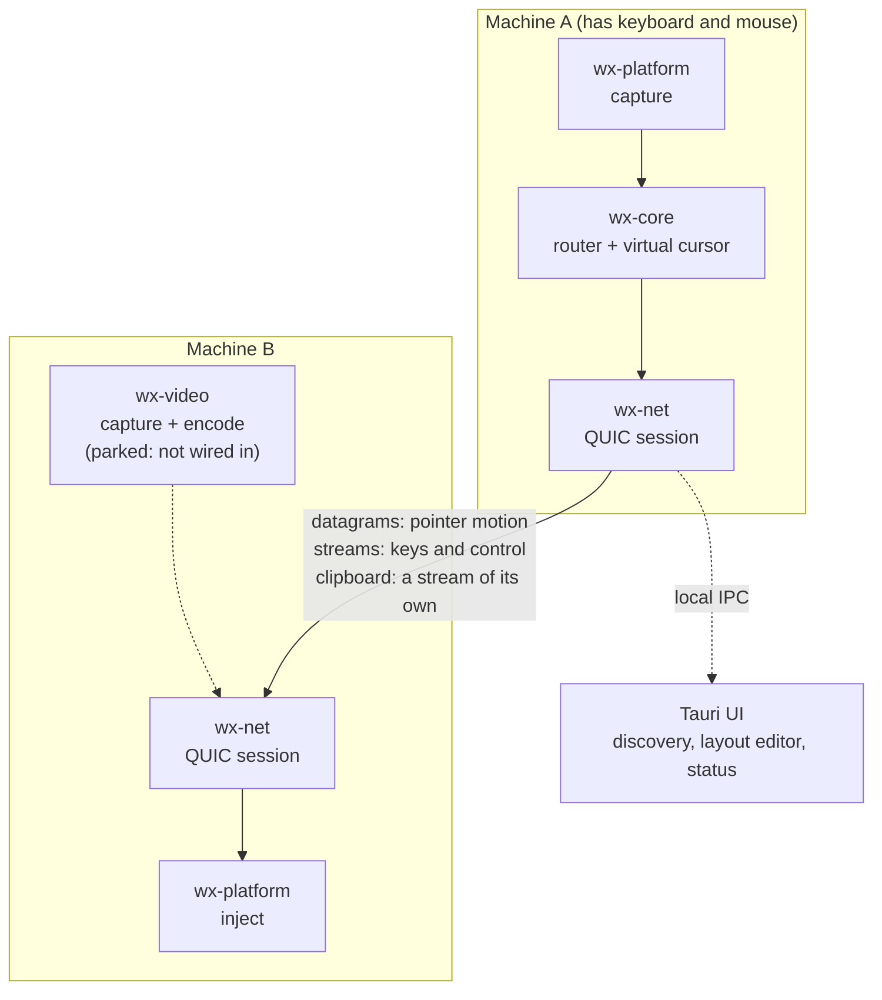

# WinXtend

[](https://github.com/the-data-sherpa/WinXtend/actions/workflows/ci.yml)

**Share one keyboard and mouse across every machine on your desk.** The idea: move
the cursor off the edge of one screen and it appears on the next machine, no KVM
switch in sight. The complete backend today is Windows, with Linux/Wayland the
alpha target.

A spiritual successor to Synergy, Barrier, and [hydra](https://github.com/PacAnimal/hydra),
written in Rust, with a QUIC transport, zero-configuration discovery, and a visual
layout editor.

---

> ### Project status: pre-alpha, and the alpha target is Linux/Wayland
>
> Read this before cloning. The engine is real and heavily tested — several hundred
> unit and integration tests, `cargo clippy` clean; run `cargo test --workspace` for
> the current figure — but the platform story needs stating plainly, because the
> complete backend and the targeted one are not the same backend:
>
> - **Windows is the only complete backend, and it is out of alpha scope.**
>   Capture, injection, displays, and the clipboard platform layer all work there.
>   Clipboard *sync* is now wired into the agent, and the wiring is platform
>   independent — but it has only been exercised live on Wayland, so on Windows
>   read it as "implemented and unit-tested", not "watched working". It is kept,
>   tested, and accurately described below — but it is not what the alpha is aimed
>   at.
> - **Linux/Wayland is the alpha target, and it is being built now.** Display
>   enumeration works: a `wl_output`/`xdg_output` client enumerates monitors, and
>   `capabilities()` advertises `HAS_DISPLAYS` only when enumeration actually found
>   one. Input injection works, over `libei` on the `xdg-desktop-portal`
>   `RemoteDesktop` session, so a Linux box can be the receiving end of a mesh.
>   Input capture works too, over the separate `InputCapture` portal that GNOME 50
>   is the first release to ship — including real local suppression: while capture
>   is active the compositor sends this agent every keystroke and local windows
>   none of them, which was measured rather than assumed. Each capability appears
>   only while its own portal session is granted and goes away the moment it is
>   not, and they can be refused independently; injection is advertised more
>   narrowly still, only once the `libei` devices that carry it have arrived and
>   been resumed a moment after the grant. The clipboard platform layer works
>   too, over `org.freedesktop.portal.Clipboard` — the only route to a selection on
>   this desktop, because Mutter offers neither `wlr-data-control` nor its
>   standardised successor and `wl_data_device` fails silently in both directions
>   without a focused surface. It rides the `RemoteDesktop` session rather than
>   opening one of its own, and is granted by its own toggle in the same dialog, so
>   a user can allow input and refuse the clipboard and be advertised as exactly
>   that. Clipboard *sync* is now wired on top of it, for text, HTML and PNG
>   images, and has been exercised between two agents with genuinely separate
>   clipboards over real QUIC — though never yet between two physical machines.
>   Two `xdg-desktop-portal` consent dialogs appear per launch, one per portal;
>   only the `RemoteDesktop` half has a restore token to suppress its own.
>   macOS, X11, and evdev are further back than Wayland now is: compiling
>   skeletons, documented down to the exact syscall sequences and implemented no
>   further. On those platforms the agent starts and does nothing.
> - **It has never moved a cursor — or a clipboard — between two physical
>   machines.** Every test runs in a single process. The QUIC handshake and session
>   tests are real, but they are loopback. Clipboard sync is the best-covered of
>   these: its end-to-end tests drive two agents with genuinely separate clipboards
>   across two real QUIC endpoints, so the exchange is proven without the
>   single-host confound — but still on loopback. The live desktop run was two
>   agents sharing one physical clipboard. Issue #11 is the two-machine test.
> - **Screen streaming is not connected.** `wx-video` compiles and its tests
>   pass, but nothing depends on it and the agent hardcodes a refusal in the
>   `ControlMsg::VideoStart | ControlMsg::VideoReconfigure` arm of
>   `crates/wx-agent/src/engine.rs`. It is parked for alpha.
>
> The protocol, layout engine, routing, transport, and pairing are the parts worth
> looking at today. Treat the rest as a well-marked construction site.

---

## What this is, and what it isn't

"KVM" is overloaded, and the distinction decides whether this project is any use
to you.

**WinXtend is a software KVM.** It shares input between machines you already own,
each of which runs a small agent and has its own display. Think Synergy: one
keyboard and mouse, several computers, cursor flows between them.

**It is not a hardware IP-KVM** like PiKVM, JetKVM, or TinyPilot. There is no HDMI
capture card and no USB HID gadget emulation, so it cannot reach a BIOS, reinstall
an operating system, or rescue a machine whose kernel has hung. Those need capture
hardware physically attached to the target, and no amount of software substitutes
for it.

So what WinXtend does today is input sharing between machines that each have their
own display. It does not send you a picture of any of them. See
the [roadmap](#roadmap) for where screen streaming stands.

## Why another one of these

Four design decisions differ from the prior art, and each one exists to kill a
specific failure mode.

### Pointer motion is sent unreliably, on purpose

Input travels over **QUIC datagrams**; control messages travel over reliable
streams. This is the one place where dropping data is correct: a lost mouse
position is superseded by the next one milliseconds later, so retransmitting it
only delays the fresh position behind stale bytes. Reliable, ordered delivery for
pointer motion is precisely how a brief packet loss becomes a visible cursor stall
— the defect users of TCP-based KVM software describe as "laggy".

Anything that *latches* state is a different matter. A dropped key-up strands a
modifier down, so key and button transitions are sent reliably. The rule is
encoded in one place, `InputEvent::reliability()`, and the sequence gate that
discards reordered motion is explicitly forbidden from discarding a late
button-release.

### Keystrokes cross the wire as text, not scancodes

Sending scancodes is what forces every Synergy-lineage tool to demand identical
keyboard layouts on every machine. A Norwegian keyboard's `å` sits where a US
keyboard has `[`; forward the scancode and the receiver types `[`.

WinXtend resolves keystrokes to **characters** on the sending machine, using the
sender's own layout, and transmits those. The receiver's job is only "produce this
codepoint", which every OS can do — `KEYEVENTF_UNICODE` on Windows,
`CGEventKeyboardSetUnicodeString` on macOS, a remapped scratch keysym on X11. Dead
keys compose on the sender and arrive as one finished character.

This idea is taken wholesale from hydra, which deserves the credit for it.

### Monitors live in one global coordinate space

There are no neighbour lists. Every monitor in the mesh is a rectangle in a single
shared coordinate space, so "what is to the right of this screen?" is answered by
geometry rather than by configuration.

That removes a whole class of setup mistake — mutually inconsistent neighbour
definitions — and makes several features fall out for free:

- **Split edges.** A 1440p screen bordering two stacked 720p screens routes by
  cursor height with no "range" syntax anywhere.
- **Gaps** in the arrangement are crossed rather than blocking.
- **The config UI is a drag-and-drop canvas** that looks like the display-settings
  pane every OS already ships, so there is nothing new to learn.

### Positions are normalized, never pixels

Coordinates cross the wire as fractions of a monitor's extent (`0.0..1.0`), so a
4K display drives a 1080p one with no scaling arithmetic and no DPI bugs on either
side.

## Architecture



| Crate | Role |
|---|---|
| `wx-proto` | Wire protocol: messages, framing, capability negotiation. No I/O, no platform code. |
| `wx-core` | Engine: global layout, edge crossing, virtual cursor, input routing. Pure logic. |
| `wx-platform` | Platform abstraction: capture, injection, displays, clipboard. |
| `wx-net` | QUIC transport, ed25519 identity, PIN pairing, mDNS discovery. |
| `wx-video` | Optional screen capture, encode, and frame pacing. **Parked: nothing depends on it.** |
| `wx-agent` | The headless daemon that wires it together, plus its IPC surface. |
| `ui/` | Tauri 2 desktop app: device discovery, layout editor, status. |

No test counts are quoted here, per crate or in total, because none of them hold
across platforms: `wx-platform`'s Windows backend and its Wayland client are gated
to different operating systems, so neither Windows nor Linux is "the" figure.
`cargo test --workspace` is the authority — see
[Testing](#why-the-test-count-differs-by-platform).

`wx-proto` and `wx-core` deliberately contain no I/O and no platform calls, which
is why the interesting behaviour — edge crossings, split edges, stuck-modifier
release, control handoff — is testable without a display server, a network, or a
second machine.

## Current status

**The alpha targets Linux/Wayland.** That is the mostly-⚠️ column below, not the ✅
one. Windows is the only backend that is finished, and it is reported accurately
here because it is real — but it is out of alpha scope, so read the Wayland column
for what the next release is about.

| | Windows | macOS | Linux/X11 | Linux/Wayland | Linux headless |
|---|---|---|---|---|---|
| Display enumeration | ✅ | ⚠️ | ⚠️ | ✅ `wl_output`/`xdg_output` | n/a |
| Input capture | ✅ | ⚠️ | ⚠️ | ✅ libei via the InputCapture portal | ⚠️ |
| Input injection | ✅ | ⚠️ | ⚠️ | ✅ libei via the RemoteDesktop portal | ⚠️ |
| Clipboard | ✅ text/HTML/PNG/files | ⚠️ | ⚠️ | ✅ text/HTML/PNG/files via the Clipboard portal | n/a |
| Screen capture | ✅ GDI | ⚠️ | ⚠️ | ⚠️ | n/a |

✅ implemented · ⚠️ compiling skeleton, requirements documented, no implementation

| Feature | State |
|---|---|
| Cursor transitions, multi-monitor, split edges | ✅ |
| QUIC transport, unreliable/reliable split | ✅ |
| mDNS auto-discovery | ✅ |
| ed25519 identity + PIN pairing | ✅ |
| Automatic first-pass layout on pairing | ✅ |
| Visual layout editor | ✅ |
| Cursor lock, reclaim, lock-all hotkeys | ✅ |
| Capability negotiation, enforced before an optional feature is attempted | ✅ |
| Ubuntu `.deb` with the agent bundled, and a systemd user unit | ✅ built; its contents are asserted by the `package` workflow, which runs on demand or on a release tag rather than on every push. Not yet installed on a clean machine |
| Start with the session, from the UI or `--install` | ✅ Windows and Linux; macOS still says what to write by hand. On Linux `systemd-analyze verify` accepts the unit, the registration is tested against a scratch config root, and on an installed machine a systemd user manager has started the packaged `/usr/bin/wx-agent` as the graphical session came up, with the UI attaching to that externally-started agent. The unit that loads there is the `~/.config/systemd/user` copy `--install` writes, so the `.deb`'s own copy under `/usr/lib/systemd/user` is still the untested one |
| Clipboard sync across machines | ⚠️ implemented for text, HTML and PNG, on a QUIC stream of its own so a large image cannot stall the cursor. File lists are deliberately never synced: the paths do not exist on the receiving machine. Proven end to end between two agents with genuinely separate clipboards over two real QUIC endpoints — but on loopback; never yet *across machines*, which is issue #11 |
| File transfer | ❌ not implemented, and no longer advertised |
| Screen streaming | ❌ crate exists, not wired into the agent |
| Relay for cross-NAT / VPN | ❌ not started |
| Wayland | ⚠️ display enumeration, input injection, input capture — including real local suppression — and clipboard sync have landed; two-machine validation and a clean-machine first run are what is left of the alpha, and Wayland input is the standing gap in every other tool in this space |

## Installing on Ubuntu

The alpha ships as a `.deb` containing both halves — the UI and the `wx-agent`
daemon — because an installer with only the UI in it produces an application that
cannot start anything.

```bash
sudo apt install ./WinXtend_0.1.0_amd64.deb
```

`apt` rather than `dpkg -i` so that the runtime dependencies are pulled in:
`xdg-desktop-portal`, `xdg-desktop-portal-gnome`, and the WebKitGTK stack Tauri
needs. Then launch **WinXtend** from the app grid; it attaches to an agent that is
already running — including one the systemd user unit below started — and starts
one itself if there is none. What the package puts where:

| Path | What it is |
|---|---|
| `/usr/bin/winxtend-ui` | The UI. Also the app-grid entry. |
| `/usr/bin/wx-agent` | The daemon. Beside the UI, which is the only place the UI trusts to hold an agent matching its protocol version, and on `PATH` for `wx-agent --status`. |
| `/usr/lib/systemd/user/winxtend.service` | The autostart unit, installed but **not** enabled. See below. |

There is no build of this for other distributions yet, and the package is
unsigned and in no repository: it is an alpha artefact to be downloaded and
installed by hand.

### Starting with the session

Turn it on from the UI — **This machine → Starts with the session**. From a
terminal, the equivalent is:

```bash
wx-agent --install      # enable
wx-agent --uninstall    # disable
```

Either way this enables a systemd **user** unit, `winxtend.service`, and it takes
effect at the next login. A *system* unit is deliberately not offered: the agent
needs the user's Wayland display, session D-Bus, and `xdg-desktop-portal`, and a
system service has none of the three — it would start, look healthy, and capture
nothing. The portal's consent and its restore token are per-user for the same
reason, and `systemctl --user` needs no root. Lingering
(`loginctl enable-linger`) is not wanted: with no graphical session there is
nothing for the agent to capture or inject into.

`--install` writes `~/.config/systemd/user/winxtend.service` naming the agent
that installed it, which shadows the packaged copy. After a `.deb` install both
name `/usr/bin/wx-agent`, so the two agree.

### Ports and firewall

| Port | Protocol | What for |
|---|---|---|
| 24800 | UDP | The QUIC listener. Configurable; `wx-agent --status` prints the port in use. |
| 5353 | UDP | mDNS, for finding other machines. |

Ubuntu ships `ufw` **disabled**, so on a stock install there is nothing to do. If
it is enabled, the agent says so — in `wx-agent --status`, in the UI's status
screen, and in its log — rather than quietly failing to be discovered, and names
the two commands that fix it:

```bash
sudo ufw allow 24800/udp
sudo ufw allow 5353/udp
```

The agent can tell that ufw is on (`/etc/ufw/ufw.conf` is world-readable) but not
whether these ports are already allowed (`/etc/ufw/user.rules` is root-only), so
the message is worded as something to check. Only `ufw` is detected; a machine
driving nftables or firewalld directly gets no warning.

## Building

Requires **Rust 1.88+** and, for the UI, **Node 20+**.

```bash
git clone git@github.com:the-data-sherpa/WinXtend.git
cd WinXtend
cargo test --workspace     # the total differs by platform — see Testing
cargo build --release      # produces target/release/wx-agent
```

### Ubuntu / Debian prerequisites

The engine compiles bundled C through two build scripts — `zstd-sys`, because
`zstd` is a default feature of `wx-video`, and `ring` — so a C compiler is its
only system prerequisite:

```bash
sudo apt install -y build-essential
```

It needs neither `pkg-config` nor `libssl-dev`, both of which the package list
in issue #2 named in error. No engine build script probes `pkg-config`:
`zstd-sys` builds the bundled C with `cc`, and probes only under its own
`pkg-config` feature or `ZSTD_SYS_USE_PKG_CONFIG`, neither of which is set
here; `wayland-sys` is built with none of its `client`/`cursor`/`egl`/`server`
features, so its build script emits nothing — `wayland-client` uses the
pure-Rust backend. Nothing in the tree links OpenSSL either: neither
`Cargo.lock` nor `ui/src-tauri/Cargo.lock` contains `openssl-sys` or
`native-tls`, and `wx-net` pins `quinn` with `default-features = false` and
`rustls-ring`, a pure-Rust TLS stack.

The Tauri UI additionally needs the WebKitGTK and tray stack:

```bash
sudo apt install -y libwebkit2gtk-4.1-dev libgtk-3-dev librsvg2-dev \
                    libayatana-appindicator3-dev libxdo-dev
```

The authority for that list is the "Install Tauri system dependencies" step in
`.github/workflows/ci.yml`, which installs those five packages and nothing else.
The engine job in the same workflow installs no packages at all, because GitHub's
runners ship a C toolchain preinstalled.

Verified on Ubuntu 26.04. `libwebkit2gtk-4.1-dev` is the Tauri 2 dependency. These
are the current Debian/Ubuntu package names; on an older release, check them against
that release's own package index.

### Windows prerequisites

The MSVC toolchain (Visual Studio Build Tools with the C++ workload) and the
WebView2 runtime, which ships with Windows 11.

The UI is a separate Cargo workspace so it does not pull Tauri into the engine
build:

```bash
cd ui && npm install
npm run bundle:agent      # required before any cargo command below
npm run build
cd src-tauri && cargo check
```

### Building the package

```bash
cd ui && npm run package:deb   # target/ui/release/bundle/deb/*.deb
```

`npm run bundle:agent` is not optional and not only for packaging.
`tauri.conf.json` declares `wx-agent` as an `externalBin`, and `tauri-build`
refuses to run at all when a declared external binary is missing — so
`cargo check`, `cargo clippy` and `cargo test` in `ui/src-tauri` all fail until it
has been run once. That is the intended behaviour: it makes "the installer
shipped without the daemon" a build failure rather than something a user finds
out. `package:deb` runs it for you, via `beforeBuildCommand`.

It builds a release `wx-agent`, copies it to
`ui/src-tauri/binaries/wx-agent-<target-triple>` — the triple suffix is how Tauri
picks the right binary, and a file without it is invisible to the bundler — and
generates `packaging/winxtend.service` from the template beside it. Both are
build products and both are `.gitignore`d.

`.github/workflows/package.yml` builds the same package on a runner and checks
that the agent, the unit, and every runtime dependency are in it. It uploads a
workflow artefact and publishes nothing: attaching a release, signing, and any
apt repository are deliberately manual for the alpha.

## Running

The agent needs no configuration file. It generates an identity on first run,
announces itself over mDNS, and discovers peers.

```bash
wx-agent                      # run in the foreground
wx-agent --status             # ask a running agent what it is doing
wx-agent --pair-with <node>   # start pairing, prints a code to read out
wx-agent --pair <code>        # enter the code shown on the other machine
wx-agent --install            # start with this user's session
wx-agent --print-config       # dump the resolved configuration
```

None of these is required to use WinXtend: everything above is reachable from the
UI, including registering autostart. They exist for scripting and for reading
what the agent thinks is going on.

On Linux `--install` enables the systemd user unit described under
[Starting with the session](#starting-with-the-session); on Windows it writes an
`HKCU\…\Run` entry. Both are per-user session registrations, and for the same
reason.

Pairing is deliberately two-sided: one machine generates a six-digit code, a human
reads it out, the other machine types it. There is no shared password in a config
file.

Configuration lives in `config.toml` in the per-user OS config directory
alongside the identity key and trust store. The QUIC listener defaults to port
**24800**.

### Sharing the clipboard

Copying on one machine makes the content pasteable on the others, for plain text,
HTML and PNG images. A file list is never sent: the paths would name files that
are not on the receiving machine, and moving them needs the file transfer this
build does not implement. Anything larger than the protocol's 32 MiB frame is
refused with a message rather than dropping the session.

It is on for every paired machine and needs no configuration. Each side also has
to advertise the matching capability — on Wayland that means the clipboard toggle
in the `xdg-desktop-portal` consent dialog, which can be refused while input is
allowed — and a machine that has not advertised it is named in a warning rather
than quietly skipped.

To turn it off for one peer, add its full hex node ID to `config.toml`.
`wx-agent --status` prints only the first eight characters; the whole ID is a key
in `trusted-peers.toml`, beside it in the same directory.

```toml
[peer.3f7a9c2b1d4e...]   # the peer's full 64-character hex node ID
clipboard = false
```

That switch is config-file only for now; there is no UI or CLI control for it
yet.

### Default hotkeys

| Chord | Action |
|---|---|
| `Ctrl+Alt+Super+L` | Pin the cursor to the machine it is on — normally this one. The one hotkey that has to exist — full-screen games and VMs are exactly where sliding onto another machine is never what you meant. |
| `Ctrl+Alt+Super+Home` | Reclaim a cursor stranded on a machine that has stopped responding. |
| `Ctrl+Alt+Super+K` | Lock every connected machine on the desk at once. One that has not advertised that it can lock itself is named in a warning rather than silently left running; a paired machine that is currently offline is neither asked nor named. |

`Super` is the Windows key, or Command on macOS. All three are configurable.

## Security model

Worth stating plainly, because one part looks wrong at a glance and is not.

1. **TLS provides encryption and the session key only.** Certificates are
   self-signed throwaways and are *not* verified against any PKI.
2. **The peer is authenticated in the application handshake**, by signing a nonce
   the other side chose *together with keying material exported from the TLS
   session itself* (RFC 5705), using the ed25519 key behind the node ID it
   advertises. The nonce makes the proof unreplayable; the exported keying
   material makes it **unrelayable**, which a nonce alone does not — a machine in
   the middle can forward someone else's signature without forging anything.
3. **That key must already be in the trust store**, which is only written after a
   successful PIN exchange.
4. **Discovery grants nothing.** An mDNS advertisement is a hint, not a
   credential.

Point 2 is the load-bearing one, and it was added in response to an adversarial
review that correctly identified a relay attack against an earlier design signing
only the nonce. Steps 2 and 3 are pure functions over messages, so every hostile
case has a unit test rather than needing two machines and a packet capture.

Nodes are identified by public key, never by hostname or IP, so a machine keeps
its identity across DHCP leases and renames.

This code has not had a professional security audit. The design is documented so
that it can be argued with; please do.

## Testing

```bash
cargo test --workspace                    # everything
cargo test -p wx-core                     # layout and routing, no I/O needed
cargo clippy --workspace --all-targets    # clean
cd ui && npm test                         # layout-editor geometry, status formatting,
                                          # attaching to an agent, what the banner may claim
```

The cargo commands above stop at the engine workspace; the Tauri crate has its own
`cargo clippy` and `cargo test`, run from `ui/src-tauri` — and needing
`npm run bundle:agent` to have been run once first, for the reason under
[Building the package](#building-the-package).
`.github/workflows/ci.yml` is the authoritative list of what every push and pull
request is checked against, on Linux, Windows, and macOS.

Tests are written to assert behaviour rather than implementation, and to cover the
adversarial cases: hostile values off the wire, NaN, zero-size rectangles, integer
overflow at coordinate extremes, datagram reordering, and frame boundaries split at
every possible byte offset.

### Why the test count differs by platform

`cargo test --workspace` legitimately reports a different total on Linux, Windows,
and macOS. That is expected, not a broken checkout. No figure is quoted anywhere in
this README on purpose: run the command, which is the only authority on what the
current number is.

Two mechanisms cause it, and they are not the same. A test that is `#[cfg]`-gated to
a platform is not compiled elsewhere at all, so it cannot be counted; a test that is
compiled everywhere but `#[cfg_attr(..., ignore)]`d off its platform is counted
ignored rather than passed. Gates like these are where the difference comes from —
examples, not an exhaustive list:

- `crates/wx-platform/src/windows/` sits behind `#[cfg(target_os = "windows")]` and
  is the largest block of tests in the crate. None of it exists in a Linux or macOS
  build, which is why Windows reports the highest total of the three.
- `crates/wx-platform/src/linux_wayland/mod.rs` declares its `outputs` module — the
  `wl_output`/`xdg_output` client — under `#[cfg(target_os = "linux")]`, so that
  module's tests exist only on Linux and are absent from a Windows or macOS build.
  The gates run in both directions, not only Windows-ward, which is why Linux and
  macOS do not report the same total as each other either.
- `crates/wx-agent/src/autostart.rs` uses both mechanisms. Several of its tests are
  `#[cfg(windows)]` outright and several others `#[cfg(target_os = "linux")]`, so
  each set is compiled on one platform and cannot be counted on the others;
  `registering_is_idempotent_and_removable` is instead
  `#[cfg_attr(not(any(windows, target_os = "linux")), ignore)]`, so it compiles
  everywhere but only runs where there is an autostart mechanism to exercise, and
  on macOS it is counted ignored rather than passed. It ran nowhere until the
  systemd user unit landed; macOS is now the only platform left that skips it.

`crates/wx-video/tests/windows_capture_smoke.rs` is `#![cfg(target_os = "windows")]`
too, but it moves no passing total: its cases are additionally `#[ignore]`d because
they need an interactive desktop, so they are skipped on Windows itself and
absent on Linux and macOS alike. Everything else — `wx-proto`, `wx-core`,
`wx-net`, and the rest of `wx-video` — runs the same tests on all three.

The totals will never converge, because each platform's tests are gated to that
platform; as the Wayland backend grows, the Linux total rises with it.

## Roadmap

The alpha is Linux/Wayland. Roughly in order of value:

1. **Validate between two physical Linux machines** over a real network. Nothing
   here is trustworthy until a cursor actually crosses one; every test today runs
   in a single process, and two agents on one desktop share one physical clipboard,
   so "it arrived on the *other* machine" is not separable on one host. Display
   enumeration, input injection, input capture and clipboard sync all work on
   Wayland now, so a Linux machine can be either end of a mesh. Wayland input is
   the standing gap in every tool in this space, and it is the strongest reason to
   prefer this one.
2. **Packaging for Linux.** The `.deb`, the systemd user unit and the autostart
   toggle have landed — see [Installing on Ubuntu](#installing-on-ubuntu). What
   is left is the first-run walkthrough on a clean machine, which needs two of
   them.
3. **A UI control for the per-peer clipboard switch.** The setting is honoured
   today but only reachable by editing `config.toml` — see
   [Sharing the clipboard](#sharing-the-clipboard).
4. **The macOS backend.**
5. **Screen streaming, once there is a backend to stream from.** This is the one
   place WinXtend would reach past a classic software KVM: a machine with no
   monitor attached sending its screen to the UI, so a headless mini-PC is usable
   rather than merely reachable. It is **not connected today** — `wx-video` exists
   and passes its tests, but nothing depends on it and `wx-agent` answers video
   requests with a refusal, in the
   `ControlMsg::VideoStart | ControlMsg::VideoReconfigure` arm of
   `crates/wx-agent/src/engine.rs`. Connecting it
   also means a real codec behind the existing `Encoder` seam; the current
   lossless passthrough is LAN-only. Even finished, it needs the agent running, so
   it would never be a bare-metal rescue tool.
6. A relay for machines on different networks or across a VPN.

## Prior art

- [hydra](https://github.com/PacAnimal/hydra) — the direct inspiration, and the
  source of the resolve-keys-to-Unicode idea. C#/.NET.
- [Synergy](https://symless.com/synergy), [Barrier](https://github.com/debauchee/barrier),
  [Input Leap](https://github.com/input-leap/input-leap),
  [Deskflow](https://github.com/deskflow/deskflow) — the lineage this belongs to.

WinXtend shares no code with any of them; the protocol and implementation are
fresh.

## Contributing

Early enough that architectural feedback is worth more than patches. If you do
send code:

- Doc comments explain *why* a decision was made, and name the failure mode it
  avoids. The code already says what it does.
- Tests are named for the behaviour they guarantee, not the function they call.
- Protocol enums are **append-only** — postcard encodes variants by index, so
  inserting one silently reinterprets every older peer's messages.

## License

MIT. See [LICENSE](LICENSE).
