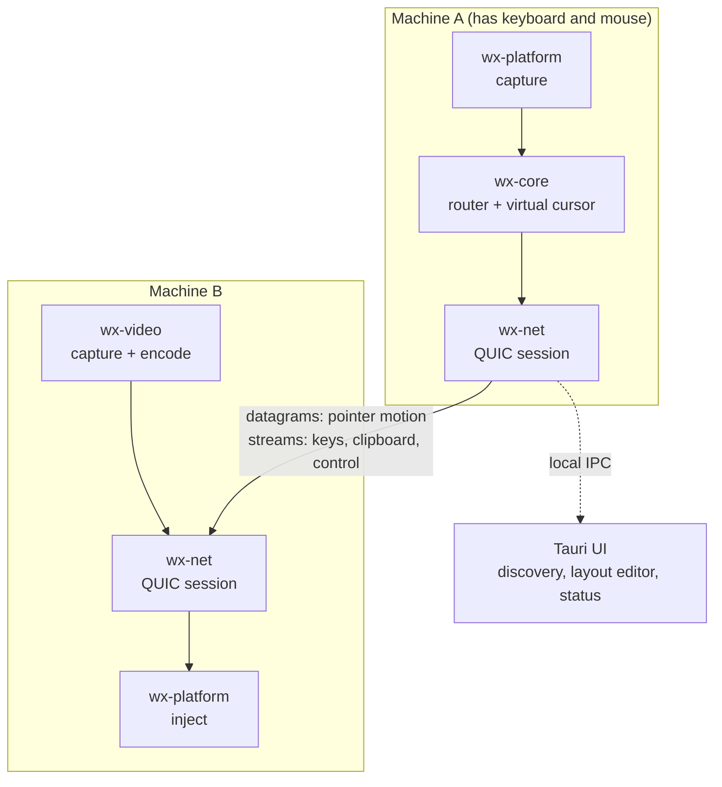

# WinXtend

[](https://github.com/the-data-sherpa/WinXtend/actions/workflows/ci.yml)

**Share one keyboard and mouse across every machine on your desk.** Move the cursor
off the edge of one screen and it appears on the next machine — Windows, macOS, or
Linux — with the clipboard following it and no KVM switch in sight.

A spiritual successor to Synergy, Barrier, and [hydra](https://github.com/PacAnimal/hydra),
written in Rust, with a QUIC transport, zero-configuration discovery, and a visual
layout editor.

---

> ### Project status: pre-alpha
>
> Read this before cloning. The engine is real and heavily tested — **614 unit and
> integration tests, `cargo clippy` clean** — but:
>
> - **Only the Windows backend is implemented.** macOS, X11, Wayland, and evdev
>   compile and are documented down to the exact syscall sequences, but they are
>   skeletons that advertise no capabilities. On those platforms the agent starts
>   and does nothing.
> - **It has never moved a cursor between two physical machines.** Every test runs
>   in a single process. The QUIC handshake and session tests are real, but they
>   are loopback.
> - **Screen streaming has no real codec yet** — lossless passthrough only, which
>   is LAN-only in practice.
>
> The protocol, layout engine, routing, transport, and pairing are the parts worth
> looking at today. Treat the rest as a well-marked construction site.

---

## What this is, and what it isn't

"KVM" is overloaded, and the distinction decides whether this project is any use
to you.

**WinXtend is a software KVM.** It shares input between machines you already own,
each of which runs a small agent and has its own display. Think Synergy: one
keyboard and mouse, several computers, cursor flows between them.

**It is not a hardware IP-KVM** like PiKVM, JetKVM, or TinyPilot. There is no HDMI
capture card and no USB HID gadget emulation, so it cannot reach a BIOS, reinstall
an operating system, or rescue a machine whose kernel has hung. Those need capture
hardware physically attached to the target, and no amount of software substitutes
for it.

The one place WinXtend reaches past a classic software KVM is **optional screen
streaming**: a machine with no monitor attached can send its screen to the UI, so a
headless mini-PC is usable rather than merely reachable. It still needs the agent
running, so it is not a bare-metal rescue tool.

## Why another one of these

Four design decisions differ from the prior art, and each one exists to kill a
specific failure mode.

### Pointer motion is sent unreliably, on purpose

Input travels over **QUIC datagrams**; control messages travel over reliable
streams. This is the one place where dropping data is correct: a lost mouse
position is superseded by the next one milliseconds later, so retransmitting it
only delays the fresh position behind stale bytes. Reliable, ordered delivery for
pointer motion is precisely how a brief packet loss becomes a visible cursor stall
— the defect users of TCP-based KVM software describe as "laggy".

Anything that *latches* state is a different matter. A dropped key-up strands a
modifier down, so key and button transitions are sent reliably. The rule is
encoded in one place, `InputEvent::reliability()`, and the sequence gate that
discards reordered motion is explicitly forbidden from discarding a late
button-release.

### Keystrokes cross the wire as text, not scancodes

Sending scancodes is what forces every Synergy-lineage tool to demand identical
keyboard layouts on every machine. A Norwegian keyboard's `å` sits where a US
keyboard has `[`; forward the scancode and the receiver types `[`.

WinXtend resolves keystrokes to **characters** on the sending machine, using the
sender's own layout, and transmits those. The receiver's job is only "produce this
codepoint", which every OS can do — `KEYEVENTF_UNICODE` on Windows,
`CGEventKeyboardSetUnicodeString` on macOS, a remapped scratch keysym on X11. Dead
keys compose on the sender and arrive as one finished character.

This idea is taken wholesale from hydra, which deserves the credit for it.

### Monitors live in one global coordinate space

There are no neighbour lists. Every monitor in the mesh is a rectangle in a single
shared coordinate space, so "what is to the right of this screen?" is answered by
geometry rather than by configuration.

That removes a whole class of setup mistake — mutually inconsistent neighbour
definitions — and makes several features fall out for free:

- **Split edges.** A 1440p screen bordering two stacked 720p screens routes by
  cursor height with no "range" syntax anywhere.
- **Gaps** in the arrangement are crossed rather than blocking.
- **The config UI is a drag-and-drop canvas** that looks like the display-settings
  pane every OS already ships, so there is nothing new to learn.

### Positions are normalized, never pixels

Coordinates cross the wire as fractions of a monitor's extent (`0.0..1.0`), so a
4K display drives a 1080p one with no scaling arithmetic and no DPI bugs on either
side.

## Architecture



| Crate | Role | Tests |
|---|---|---|
| `wx-proto` | Wire protocol: messages, framing, capability negotiation. No I/O, no platform code. | 67 |
| `wx-core` | Engine: global layout, edge crossing, virtual cursor, input routing. Pure logic. | 86 |
| `wx-platform` | Platform abstraction: capture, injection, displays, clipboard. | 160 |
| `wx-net` | QUIC transport, ed25519 identity, PIN pairing, mDNS discovery. | 102 |
| `wx-video` | Optional screen capture, encode, and frame pacing. | 61 |
| `wx-agent` | The headless daemon that wires it together, plus its IPC surface. | 139 |
| `ui/` | Tauri 2 desktop app: device discovery, layout editor, status. | — |

`wx-proto` and `wx-core` deliberately contain no I/O and no platform calls, which
is why the interesting behaviour — edge crossings, split edges, stuck-modifier
release, control handoff — is testable without a display server, a network, or a
second machine.

## Current status

| | Windows | macOS | Linux/X11 | Linux/Wayland | Linux headless |
|---|---|---|---|---|---|
| Display enumeration | ✅ | ⚠️ | ⚠️ | ⚠️ | n/a |
| Input capture | ✅ | ⚠️ | ⚠️ | ⚠️ | ⚠️ |
| Input injection | ✅ | ⚠️ | ⚠️ | ⚠️ | ⚠️ |
| Clipboard | ✅ text/HTML/PNG | ⚠️ | ⚠️ | ⚠️ | n/a |
| Screen capture | ✅ GDI | ⚠️ | ⚠️ | ⚠️ | n/a |

✅ implemented · ⚠️ compiling skeleton, requirements documented, no implementation

| Feature | State |
|---|---|
| Cursor transitions, multi-monitor, split edges | ✅ |
| QUIC transport, unreliable/reliable split | ✅ |
| mDNS auto-discovery | ✅ |
| ed25519 identity + PIN pairing | ✅ |
| Automatic first-pass layout on pairing | ✅ |
| Visual layout editor | ✅ |
| Cursor lock, reclaim, lock-all hotkeys | ✅ |
| Capability negotiation, enforced before an optional feature is attempted | ✅ |
| Clipboard sync across machines | ⚠️ platform side done, not wired into the agent |
| File transfer | ❌ not implemented, and no longer advertised |
| Screen streaming | ⚠️ passthrough only, no real codec |
| Relay for cross-NAT / VPN | ❌ not started |
| Wayland | ❌ the reason to pick this over Synergy, still to do |

## Building

Requires **Rust 1.79+** and, for the UI, **Node 20+**.

```bash
git clone git@github.com:the-data-sherpa/WinXtend.git
cd WinXtend
cargo test --workspace     # 614 tests
cargo build --release      # produces target/release/wx-agent
```

On Windows you also need the MSVC toolchain (Visual Studio Build Tools with the
C++ workload) and the WebView2 runtime, which ships with Windows 11.

The UI is a separate Cargo workspace so it does not pull Tauri into the engine
build:

```bash
cd ui && npm install && npm run build
cd src-tauri && cargo check
```

## Running

The agent needs no configuration file. It generates an identity on first run,
announces itself over mDNS, and discovers peers.

```bash
wx-agent                      # run in the foreground
wx-agent --status             # ask a running agent what it is doing
wx-agent --pair-with <node>   # start pairing, prints a code to read out
wx-agent --pair <code>        # enter the code shown on the other machine
wx-agent --install            # start with this user's session
wx-agent --print-config       # dump the resolved configuration
```

Pairing is deliberately two-sided: one machine generates a six-digit code, a human
reads it out, the other machine types it. There is no shared password in a config
file.

Configuration lives in `config.toml` in the per-user OS config directory
alongside the identity key and trust store. The QUIC listener defaults to port
**24800**.

### Default hotkeys

| Chord | Action |
|---|---|
| `Ctrl+Alt+Super+L` | Pin the cursor to this machine. The one hotkey that has to exist — full-screen games and VMs are exactly where sliding onto another machine is never what you meant. |
| `Ctrl+Alt+Super+Home` | Reclaim a cursor stranded on a machine that has stopped responding. |
| `Ctrl+Alt+Super+K` | Lock every machine on the desk at once. A machine that has not advertised that it can lock itself is named in a warning rather than silently left running. |

`Super` is the Windows key, or Command on macOS. All three are configurable.

## Security model

Worth stating plainly, because one part looks wrong at a glance and is not.

1. **TLS provides encryption and the session key only.** Certificates are
   self-signed throwaways and are *not* verified against any PKI.
2. **The peer is authenticated in the application handshake**, by signing a nonce
   the other side chose *together with keying material exported from the TLS
   session itself* (RFC 5705), using the ed25519 key behind the node ID it
   advertises. The nonce makes the proof unreplayable; the exported keying
   material makes it **unrelayable**, which a nonce alone does not — a machine in
   the middle can forward someone else's signature without forging anything.
3. **That key must already be in the trust store**, which is only written after a
   successful PIN exchange.
4. **Discovery grants nothing.** An mDNS advertisement is a hint, not a
   credential.

Point 2 is the load-bearing one, and it was added in response to an adversarial
review that correctly identified a relay attack against an earlier design signing
only the nonce. Steps 2 and 3 are pure functions over messages, so every hostile
case has a unit test rather than needing two machines and a packet capture.

Nodes are identified by public key, never by hostname or IP, so a machine keeps
its identity across DHCP leases and renames.

This code has not had a professional security audit. The design is documented so
that it can be argued with; please do.

## Testing

```bash
cargo test --workspace                    # everything
cargo test -p wx-core                     # layout and routing, no I/O needed
cargo clippy --workspace --all-targets    # clean
cd ui && npm test                         # layout-editor geometry, status formatting
```

The cargo commands above stop at the engine workspace; the Tauri crate has its own
`cargo clippy` and `cargo test`, run from `ui/src-tauri`.
`.github/workflows/ci.yml` is the authoritative list of what every push and pull
request is checked against, on Linux, Windows, and macOS.

Tests are written to assert behaviour rather than implementation, and to cover the
adversarial cases: hostile values off the wire, NaN, zero-size rectangles, integer
overflow at coordinate extremes, datagram reordering, and frame boundaries split at
every possible byte offset.

## Roadmap

Roughly in order of value:

1. **Validate between two physical Windows machines.** Nothing here is trustworthy
   until a cursor actually crosses a real network.
2. **Wire clipboard sync into the agent.** The platform side already works.
3. **macOS backend**, then **Wayland** — Wayland being the standing gap in every
   tool in this space, and the strongest reason to prefer this one.
4. A real video codec behind the existing `Encoder` seam.
5. A relay for machines on different networks or across a VPN.

## Prior art

- [hydra](https://github.com/PacAnimal/hydra) — the direct inspiration, and the
  source of the resolve-keys-to-Unicode idea. C#/.NET.
- [Synergy](https://symless.com/synergy), [Barrier](https://github.com/debauchee/barrier),
  [Input Leap](https://github.com/input-leap/input-leap),
  [Deskflow](https://github.com/deskflow/deskflow) — the lineage this belongs to.

WinXtend shares no code with any of them; the protocol and implementation are
fresh.

## Contributing

Early enough that architectural feedback is worth more than patches. If you do
send code:

- Doc comments explain *why* a decision was made, and name the failure mode it
  avoids. The code already says what it does.
- Tests are named for the behaviour they guarantee, not the function they call.
- Protocol enums are **append-only** — postcard encodes variants by index, so
  inserting one silently reinterprets every older peer's messages.

## License

MIT. See [LICENSE](LICENSE).
